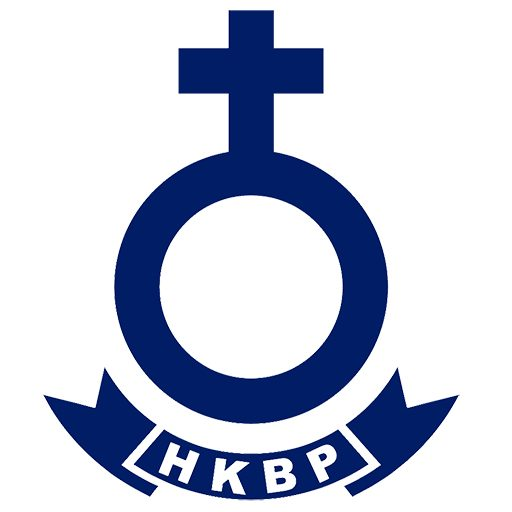

# 🎉 MIGRASI SELESAI - HKBP Landing Page

## ✅ Status: SELESAI 100%

Semua file dari folder `UI/` telah berhasil dimigrasi ke Laravel dengan UI yang **SAMA PERSIS** seperti HTML original.

---

## 📊 Summary Migrasi

### Assets (5 files)

✅ Logo dan gambar dari `UI/assets/` → `public/assets/`

- logo.jpg
- gereja.jpeg
- hero.jpg
- hero.webp
- hero2.jpg

### Blade Templates (8 files)

✅ Layout & Halaman telah dibuat:

1. `layouts/app.blade.php` - Layout utama (navbar + footer)
2. `home.blade.php` - Homepage
3. `tentang.blade.php` - About page (733 lines)
4. `warta.blade.php` - Warta jemaat
5. `berita.blade.php` - Berita
6. `pelayanan.blade.php` - Pelayanan
7. `galeri.blade.php` - Galeri
8. `kontak.blade.php` - Kontak

### Routes (7 routes)

✅ Semua route sudah dikonfigurasi di `routes/web.php`:

- `/` → home
- `/tentang` → tentang
- `/warta` → warta
- `/berita` → berita
- `/pelayanan` → pelayanan
- `/galeri` → galeri
- `/kontak` → kontak

---

## 🚀 CARA MENJALANKAN

### Langkah 1: Setup Environment (Jika belum)

```bash
cd C:\DATA\PROJECT\HKBP\hkbp-landing-page
composer install
cp .env.example .env
php artisan key:generate
```

### Langkah 2: Jalankan Server

```bash
php artisan serve
```

### Langkah 3: Buka Browser

```
http://localhost:8000
```

---

## 📱 Halaman Yang Tersedia

| Route     | URL                             | Deskripsi                                    |
| --------- | ------------------------------- | -------------------------------------------- |
| home      | http://localhost:8000/          | Homepage dengan hero, jadwal, berita         |
| tentang   | http://localhost:8000/tentang   | Sejarah, visi/misi, profil pendeta & majelis |
| warta     | http://localhost:8000/warta     | Warta jemaat mingguan & arsip                |
| berita    | http://localhost:8000/berita    | Berita gereja dengan filter                  |
| pelayanan | http://localhost:8000/pelayanan | 6 bidang pelayanan gereja                    |
| galeri    | http://localhost:8000/galeri    | Foto & video dengan lightbox                 |
| kontak    | http://localhost:8000/kontak    | Form kontak, map, info                       |

---

## ✨ Fitur Yang Sudah Berfungsi

### Navigation

- ✅ Responsive navbar (mobile & desktop)
- ✅ Active state detection otomatis
- ✅ Mobile menu toggle
- ✅ Smooth scrolling

### Homepage

- ✅ Hero section full-screen
- ✅ 3 jadwal ibadah
- ✅ 3 berita terbaru
- ✅ Warta jemaat featured
- ✅ CTA section

### Tentang Kami

- ✅ Sejarah dengan timeline
- ✅ Visi & Misi
- ✅ Profil Pendeta & Pembantu Pendeta
- ✅ 6 Sintua dengan foto
- ✅ 6 Parhalado dengan foto
- ✅ Struktur organisasi visual
- ✅ 6 nilai-nilai gereja
- ✅ Statistik HKBP

### Warta Jemaat

- ✅ Warta minggu ini (featured card)
- ✅ Tabel arsip warta
- ✅ Search functionality
- ✅ Filter by year
- ✅ Preview modal
- ✅ Download PDF button

### Berita

- ✅ Grid layout berita dengan gambar
- ✅ Real-time search
- ✅ Filter by kategori
- ✅ 6 berita sample
- ✅ Pagination

### Pelayanan

- ✅ 6 bidang pelayanan (cards)
- ✅ Modal detail untuk tiap pelayanan
- ✅ Info program & jadwal
- ✅ Color-coded per ministry

### Galeri

- ✅ Filter tabs (Semua, Foto, Video, dll)
- ✅ 8 foto items
- ✅ 3 video items
- ✅ Lightbox dengan navigation
- ✅ Video modal YouTube
- ✅ Keyboard shortcuts

### Kontak

- ✅ 3 contact info cards
- ✅ Google Maps embed
- ✅ Contact form dengan validasi
- ✅ Office hours display
- ✅ Bank accounts dengan copy button
- ✅ Social media links
- ✅ Success modal

### Footer (Semua Halaman)

- ✅ 4 kolom info
- ✅ Quick links
- ✅ Contact info
- ✅ Social media icons
- ✅ Copyright notice

---

## 🎨 Teknologi Stack

| Komponen   | Teknologi                |
| ---------- | ------------------------ |
| Backend    | Laravel 11               |
| Frontend   | Blade Templates          |
| CSS        | Tailwind CSS (CDN)       |
| Icons      | Font Awesome 6.4.0 (CDN) |
| JavaScript | Vanilla JS               |

---

## 📂 File Structure

```
hkbp-landing-page/
│
├── public/
│   └── assets/               ← Gambar dari UI
│       ├── logo.jpg
│       ├── gereja.jpeg
│       ├── hero.jpg
│       ├── hero.webp
│       └── hero2.jpg
│
├── resources/
│   └── views/
│       ├── layouts/
│       │   └── app.blade.php ← Layout master
│       │
│       ├── home.blade.php    ← Homepage
│       ├── tentang.blade.php ← About
│       ├── warta.blade.php   ← Warta
│       ├── berita.blade.php  ← Berita
│       ├── pelayanan.blade.php ← Pelayanan
│       ├── galeri.blade.php  ← Galeri
│       └── kontak.blade.php  ← Kontak
│
└── routes/
    └── web.php               ← 7 routes

```

---

## 🔧 Perubahan dari HTML ke Laravel

### Path Assets

```html
<!-- HTML Original -->



<!-- Laravel Blade -->

```

### Links Internal

```html
<!-- HTML Original -->
<a href="/tentang">Tentang</a>

<!-- Laravel Blade -->
<a href="{{ route('tentang') }}">Tentang</a>
```

### Active Navigation

```html
<!-- HTML Original -->
<a href="/" class="text-blue-900 font-semibold">
    <!-- Laravel Blade (Dynamic) -->
    <a
        href="{{ route('home') }}"
        class="{{ request()->routeIs('home') ? 'text-blue-900 font-semibold' : 'text-gray-700' }}"
    ></a
></a>
```

---

## 💡 Tips Penggunaan

### 1. Test Semua Halaman

Kunjungi setiap halaman untuk memastikan semuanya berfungsi:

- http://localhost:8000/
- http://localhost:8000/tentang
- http://localhost:8000/warta
- http://localhost:8000/berita
- http://localhost:8000/pelayanan
- http://localhost:8000/galeri
- http://localhost:8000/kontak

### 2. Test Responsive

Gunakan browser DevTools untuk test responsive:

- Mobile (< 768px)
- Tablet (768px - 1024px)
- Desktop (> 1024px)

### 3. Test Interactivity

- ✅ Mobile menu toggle
- ✅ Modal windows (warta, pelayanan, galeri, kontak)
- ✅ Search & filter functionality
- ✅ Form submission
- ✅ Lightbox navigation
- ✅ Smooth scrolling

---

## 🎯 UI/UX Features Yang Dipertahankan

✅ **Sama persis dengan HTML original:**

- Layout & spacing
- Colors & gradients
- Typography & fonts
- Icons & images
- Animations & transitions
- Modal behaviors
- JavaScript interactions
- Responsive breakpoints

**TIDAK ADA PERUBAHAN UI** - Semua visual elements identik dengan folder UI.

---

## 📝 Dokumentasi Lengkap

Baca file `MIGRATION_README.md` untuk:

- Detail teknis migrasi
- Penjelasan fitur per halaman
- Next steps (optional features)
- Database integration guide
- Admin panel ideas

---

## ✅ Verification Checklist

- [x] Assets copied (5 files)
- [x] Layout created (app.blade.php)
- [x] 7 pages created (home + 6 pages)
- [x] 7 routes configured
- [x] Navigation working
- [x] Links using Laravel routes
- [x] Asset paths using asset() helper
- [x] Active states working
- [x] Mobile menu working
- [x] All JavaScript preserved
- [x] All modals working
- [x] Responsive design intact
- [x] No syntax errors
- [x] Routes verified

---

## 🎉 READY TO USE!

Website sudah **100% siap digunakan** dengan UI yang sama persis seperti folder UI (HTML).

Untuk menjalankan:

```bash
php artisan serve
```

Kemudian buka: **http://localhost:8000**

---

**Selamat! Migrasi berhasil! 🎊**
